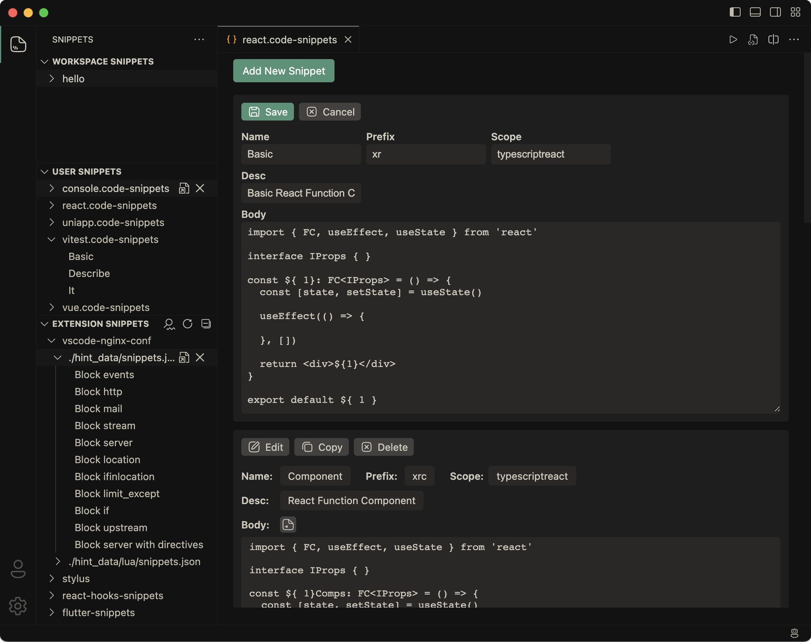

<em>Snippets Manager for VS Code</em>
<h1 align="center">
  
</h1>

### Introduction

Easily manage your code snippets in vscode.

### Preview

### Reference

This plugin is based on the open source project by [vscode-snippets-manager](https://github.com/zjffun/vscode-snippets-manager), focusing on UI/UX optimization. Thanks to [zjffun](https://github.com/zjffun) for their contribution! If you encounter any functional issues, please visit [vscode-snippets-manager](https://github.com/zjffun/vscode-snippets-manager/issues) for support.